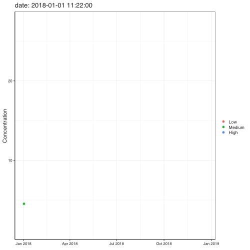
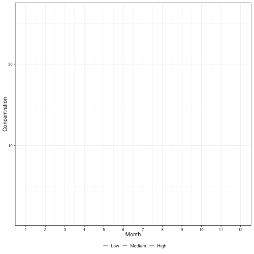
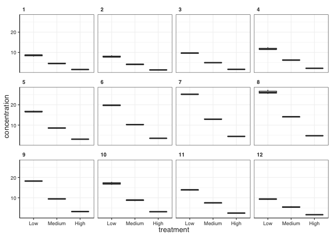
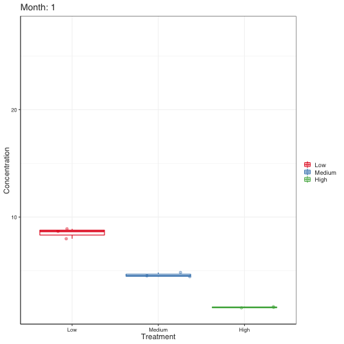
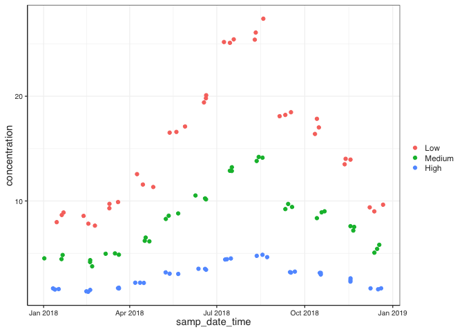

# Loading the packages and formating


Note that you might get the following warnings:

"No renderer backend detected. gganimate will default to writing frames to separate files
Consider installing:
- the `gifski` package for gif output
- the `av` package for video output
and restarting the R session"

gganimate uses other packages to do the bulk of the work (wether it is creating a .gif or a video), depending on what you are aiming to do, you might need to install one of those packages. Today we are going to be making gifs, so we will need `gifski`. You just have to install it, you dont need to load it yourself, as `gganimate will do that in the background, it just needs it to be installed`


```r
source(here("functions", "theme_pepe_full.R"))

theme_set(theme_pepe_full())  #Sets the theme for all ggplot plots in this .Rmd file (no need to call it in the plot itself)
```

# Loading the data

Today we are going to work with the mock-up data of a time series that we have used already in previous classses.


```r
ts_data <- read_csv(here("data", "time_series.csv"))
```

```
## Rows: 540 Columns: 20
```

```
## ── Column specification ────────────────────────────────────────────────────────
## Delimiter: ","
## chr  (8): sample_id, site_id, collected_by, sampling_time, treatment, batch,...
## dbl  (9): day, month, year, hh, mm, altitude, latitude, longitude, concentra...
## dttm (1): samp_date_time
## date (2): sampling_date, submission_date
```

```
## 
## ℹ Use `spec()` to retrieve the full column specification for this data.
## ℹ Specify the column types or set `show_col_types = FALSE` to quiet this message.
```

```r
ts_data <- ts_data %>% 
  mutate(treatment = factor(treatment, levels = c("Low", "Medium", "High")))
```


# Animated figures

WE will be using the package `{gganimate}` for this. You can find all the info you need [here](https://www.gganimate.com/reference/index.html)

## Adding point by point along axis

This one is easiest. We can use `transition_time()` as this one intended for data where the states are representing specific point in time. 


```r
figure_1 <- ts_data %>% 
  filter( compound == "compound_1") %>% 
  ggplot() +
  geom_point(aes(x = samp_date_time, y = concentration, colour = treatment)) +

  # ggannimate sections
  
  labs(x = NULL,
       y = "Concentration",
       title = 'date: {frame_time}') +
  transition_time(samp_date_time) +
  shadow_mark()

figure_1 <- animate(figure_1, duration = 10, width = 500, height = 500,  renderer = gifski_renderer(loop = TRUE))

figure_1  # NOTE: print(figure_1) works to show it in the viewer, but it wont knit the gif
```

<!-- -->


NOTE: You might get this error: "Error in transform_path(all_frames, states[[i]], ease, nframes[i], !!id, : transformr is required to tween paths and lines"


```r
anim_save(here("figures", "figure_1.gif"), figure_1)
```


## Revealing along axis

It is easy to add ponts to a plot, but when we have an object that "exists" along the whole plot (e.g. a line) things get more complicated, as the program needs to figure out how to display the non-existing data (e.g. the interpolation line betwene two points). For this it is just easier to use `transition_reveal()` which basically renders the whole plot in advance and the it just reveals parts of it as we go.


```r
figure_2 <- ts_data %>% 
  filter( compound == "compound_1") %>% 
  group_by(treatment, year, month) %>% 
  summarise(mean_concentration = mean(concentration, na.rm = TRUE)) %>% 
  ggplot() +
  geom_line(aes(x = month, y = mean_concentration, colour = treatment)) +
  scale_x_continuous(breaks = seq(1,12, by = 1)) +
  theme(legend.position = "bottom") +
  labs(x = "Month",
       y = "Concentration") +

  # ggannimate sections
  transition_reveal(along = month)
```

```
## `summarise()` has grouped output by 'treatment', 'year'. You can override using the `.groups` argument.
```

```r
figure_2 <- animate(figure_2, duration = 10, width = 500, height = 500,  renderer = gifski_renderer(loop = TRUE))

figure_2
```

<!-- -->


```r
anim_save(here("figures", "figure_2.gif"), figure_2)
```


## shape-shifting plots

What is we want to transition between "completely different plots", for example, different box plots each showing different monthly data? 

Lets look into what it is we want to do. Basically we want to take the facetted boxplot below and animate it so it can transition from one panel to the next


```r
ts_data %>% 
  filter( compound == "compound_1") %>% 
  ggplot() +
  facet_wrap(~month) +
  geom_boxplot(aes(x = treatment, y = concentration))
```

<!-- -->
Here we need to use `transition_states()` to define what our *states* are going to be (i.e. each monthly box plot), and how to transition from one to the other. This is caled **Tweening** and allows control over how graphical elements change into, between, and out of states.in these case we are using `enter_fade()` to tell that the entering plot should fade-in and `exit_shrink()` that the leaving plot should shrink out.


```r
figure_3 <- ts_data %>% 
  filter( compound == "compound_1") %>% 
  ggplot() +
  geom_boxplot(aes(x = treatment, y = concentration, colour = treatment)) +
  geom_jitter(aes(x = treatment, y = concentration, colour = treatment), alpha = 0.4) +
  scale_colour_brewer(palette = "Set1") +
 
   # ggannimate sections
   transition_states(
    month,
    state_length = 1,
    transition_length = 2
  ) +
  labs(x = "Treatment",
       y = "Concentration",
       title = "Month: {closest_state}") +
  enter_fade() +
  exit_shrink() +
  ease_aes('sine-in-out')

figure_3 <- animate(figure_3, duration = 10, width = 500, height = 500,  renderer = gifski_renderer(loop = TRUE))


figure_3  # NOTE: print(figure_3) works to show it in the viewer, but it wont knit the gif
```

<!-- -->


```r
anim_save(here("figures", "figure_3.gif"), figure_3)
```


# Interactive plots with `plotly`

Interactive plots allow us to explore the data (e.g. zoom in and out) and can be very helpful in exploratory stages when you are making sure all your data lok alright and are trying to determine if there are any outliers

For this we can use the `{ggplotly}` package, wich serves as a translation layer between R and **plotly**, a visualization engine based on *javascript*

Using it is fairly easy, you just make a ggplot and then apply `ggplotly()` to it.


```r
figure_4 <- ts_data %>% 
  filter( compound == "compound_1") %>% 
  ggplot() +
  geom_point(aes(x = samp_date_time, y = concentration, colour = treatment)) 

figure_4
```

<!-- -->


Unfortunately, as mentioned `ggplotly` is mainly a translator and sometimes there are things from one language that dont have a direct translation in another one. Same here, many conponents of ggplot will not translate in the ggplotly version, so plots are usually simplified. Either way it is quite useful for exploratory work.


```r
ggplotly(figure_4)
```

```{=html}
<div id="htmlwidget-9a313af1fe7b16cefc26" style="width:672px;height:480px;" class="plotly html-widget"></div>
<script type="application/json" data-for="htmlwidget-9a313af1fe7b16cefc26">{"x":{"data":[{"x":[1516563540,1515947520,1516404240,1518805920,1519399380,1518374040,1520710200,1520703060,1521488220,1524666420,1523201340,1523730780,1527539280,1526758020,1526149200,1529426280,1529249340,1529447280,1531593000,1531938420,1531056000,1533926100,1533838860,1534609740,1537107840,1536081960,1536597360,1539451500,1539275580,1539627900,1542483360,1542043980,1541957700,1545427980,1544221200,1544636040],"y":[8.8998042889516,7.97741717550249,8.66017361115455,7.83130612338196,7.64332395442329,8.57440226785802,9.72336405518513,9.30161131533752,9.89637146380878,11.3326783845083,12.562977662209,11.5676956777516,17.1110800004959,16.5915194578982,16.5230431532937,19.8058268513551,19.4081241480042,20.0943596462983,25.0986215780183,25.4323797992534,25.1772210855143,26.0804795050324,25.4007486601353,27.4023929190043,18.4722258702898,18.0934249794729,18.2155183805578,17.8445552863473,16.3981593193746,17.0207560641562,13.9476670057137,14.0243496675771,13.5031917384942,9.64222904041534,9.39040912338845,9.00584608427111],"text":["samp_date_time: 2018-01-21 19:39:00<br />concentration:  8.899804<br />treatment: Low","samp_date_time: 2018-01-14 16:32:00<br />concentration:  7.977417<br />treatment: Low","samp_date_time: 2018-01-19 23:24:00<br />concentration:  8.660174<br />treatment: Low","samp_date_time: 2018-02-16 18:32:00<br />concentration:  7.831306<br />treatment: Low","samp_date_time: 2018-02-23 15:23:00<br />concentration:  7.643324<br />treatment: Low","samp_date_time: 2018-02-11 18:34:00<br />concentration:  8.574402<br />treatment: Low","samp_date_time: 2018-03-10 19:30:00<br />concentration:  9.723364<br />treatment: Low","samp_date_time: 2018-03-10 17:31:00<br />concentration:  9.301611<br />treatment: Low","samp_date_time: 2018-03-19 19:37:00<br />concentration:  9.896371<br />treatment: Low","samp_date_time: 2018-04-25 14:27:00<br />concentration: 11.332678<br />treatment: Low","samp_date_time: 2018-04-08 15:29:00<br />concentration: 12.562978<br />treatment: Low","samp_date_time: 2018-04-14 18:33:00<br />concentration: 11.567696<br />treatment: Low","samp_date_time: 2018-05-28 20:28:00<br />concentration: 17.111080<br />treatment: Low","samp_date_time: 2018-05-19 19:27:00<br />concentration: 16.591519<br />treatment: Low","samp_date_time: 2018-05-12 18:20:00<br />concentration: 16.523043<br />treatment: Low","samp_date_time: 2018-06-19 16:38:00<br />concentration: 19.805827<br />treatment: Low","samp_date_time: 2018-06-17 15:29:00<br />concentration: 19.408124<br />treatment: Low","samp_date_time: 2018-06-19 22:28:00<br />concentration: 20.094360<br />treatment: Low","samp_date_time: 2018-07-14 18:30:00<br />concentration: 25.098622<br />treatment: Low","samp_date_time: 2018-07-18 18:27:00<br />concentration: 25.432380<br />treatment: Low","samp_date_time: 2018-07-08 13:20:00<br />concentration: 25.177221<br />treatment: Low","samp_date_time: 2018-08-10 18:35:00<br />concentration: 26.080480<br />treatment: Low","samp_date_time: 2018-08-09 18:21:00<br />concentration: 25.400749<br />treatment: Low","samp_date_time: 2018-08-18 16:29:00<br />concentration: 27.402393<br />treatment: Low","samp_date_time: 2018-09-16 14:24:00<br />concentration: 18.472226<br />treatment: Low","samp_date_time: 2018-09-04 17:26:00<br />concentration: 18.093425<br />treatment: Low","samp_date_time: 2018-09-10 16:36:00<br />concentration: 18.215518<br />treatment: Low","samp_date_time: 2018-10-13 17:25:00<br />concentration: 17.844555<br />treatment: Low","samp_date_time: 2018-10-11 16:33:00<br />concentration: 16.398159<br />treatment: Low","samp_date_time: 2018-10-15 18:25:00<br />concentration: 17.020756<br />treatment: Low","samp_date_time: 2018-11-17 19:36:00<br />concentration: 13.947667<br />treatment: Low","samp_date_time: 2018-11-12 17:33:00<br />concentration: 14.024350<br />treatment: Low","samp_date_time: 2018-11-11 17:35:00<br />concentration: 13.503192<br />treatment: Low","samp_date_time: 2018-12-21 21:33:00<br />concentration:  9.642229<br />treatment: Low","samp_date_time: 2018-12-07 22:20:00<br />concentration:  9.390409<br />treatment: Low","samp_date_time: 2018-12-12 17:34:00<br />concentration:  9.005846<br />treatment: Low"],"type":"scatter","mode":"markers","marker":{"autocolorscale":false,"color":"rgba(248,118,109,1)","opacity":1,"size":5.66929133858268,"symbol":"circle","line":{"width":1.88976377952756,"color":"rgba(248,118,109,1)"}},"hoveron":"points","name":"Low","legendgroup":"Low","showlegend":true,"xaxis":"x","yaxis":"y","hoverinfo":"text","frame":null},{"x":[1514827320,1516480440,1516378980,1518971100,1519147980,1518960540,1521563640,1520368320,1521210540,1523982360,1524317580,1523900160,1526063040,1526919840,1525803960,1529346720,1529433480,1528482120,1531589580,1531762440,1531765920,1534537380,1534192320,1534008780,1537205580,1536852780,1536600720,1540143120,1539448140,1539876600,1542735000,1542814860,1542480060,1545082140,1544643300,1544890800],"y":[4.52194323641053,4.83841562586568,4.44616387939848,4.34939941877772,3.75723360349931,4.16804375378753,4.8676582452545,4.95798119521765,4.9916857500451,6.50730037350174,6.14388334437228,6.19572545361092,8.59299562685232,8.80978727173039,8.28415383411351,10.2440430951872,10.1516081282706,10.5223769568858,12.8850299431053,12.8659106249596,13.2189924909597,14.1309789424371,14.204079317467,13.8177944531019,9.42716295672828,9.71430350478703,9.22742514408329,9.01166751318734,8.35879878869335,8.91522040345487,7.17557828779023,7.5233160797478,7.59209483846108,5.81432756127589,5.06306692492583,5.42380783221483],"text":["samp_date_time: 2018-01-01 17:22:00<br />concentration:  4.521943<br />treatment: Medium","samp_date_time: 2018-01-20 20:34:00<br />concentration:  4.838416<br />treatment: Medium","samp_date_time: 2018-01-19 16:23:00<br />concentration:  4.446164<br />treatment: Medium","samp_date_time: 2018-02-18 16:25:00<br />concentration:  4.349399<br />treatment: Medium","samp_date_time: 2018-02-20 17:33:00<br />concentration:  3.757234<br />treatment: Medium","samp_date_time: 2018-02-18 13:29:00<br />concentration:  4.168044<br />treatment: Medium","samp_date_time: 2018-03-20 16:34:00<br />concentration:  4.867658<br />treatment: Medium","samp_date_time: 2018-03-06 20:32:00<br />concentration:  4.957981<br />treatment: Medium","samp_date_time: 2018-03-16 14:29:00<br />concentration:  4.991686<br />treatment: Medium","samp_date_time: 2018-04-17 16:26:00<br />concentration:  6.507300<br />treatment: Medium","samp_date_time: 2018-04-21 13:33:00<br />concentration:  6.143883<br />treatment: Medium","samp_date_time: 2018-04-16 17:36:00<br />concentration:  6.195725<br />treatment: Medium","samp_date_time: 2018-05-11 18:24:00<br />concentration:  8.592996<br />treatment: Medium","samp_date_time: 2018-05-21 16:24:00<br />concentration:  8.809787<br />treatment: Medium","samp_date_time: 2018-05-08 18:26:00<br />concentration:  8.284154<br />treatment: Medium","samp_date_time: 2018-06-18 18:32:00<br />concentration: 10.244043<br />treatment: Medium","samp_date_time: 2018-06-19 18:38:00<br />concentration: 10.151608<br />treatment: Medium","samp_date_time: 2018-06-08 18:22:00<br />concentration: 10.522377<br />treatment: Medium","samp_date_time: 2018-07-14 17:33:00<br />concentration: 12.885030<br />treatment: Medium","samp_date_time: 2018-07-16 17:34:00<br />concentration: 12.865911<br />treatment: Medium","samp_date_time: 2018-07-16 18:32:00<br />concentration: 13.218992<br />treatment: Medium","samp_date_time: 2018-08-17 20:23:00<br />concentration: 14.130979<br />treatment: Medium","samp_date_time: 2018-08-13 20:32:00<br />concentration: 14.204079<br />treatment: Medium","samp_date_time: 2018-08-11 17:33:00<br />concentration: 13.817794<br />treatment: Medium","samp_date_time: 2018-09-17 17:33:00<br />concentration:  9.427163<br />treatment: Medium","samp_date_time: 2018-09-13 15:33:00<br />concentration:  9.714304<br />treatment: Medium","samp_date_time: 2018-09-10 17:32:00<br />concentration:  9.227425<br />treatment: Medium","samp_date_time: 2018-10-21 17:32:00<br />concentration:  9.011668<br />treatment: Medium","samp_date_time: 2018-10-13 16:29:00<br />concentration:  8.358799<br />treatment: Medium","samp_date_time: 2018-10-18 15:30:00<br />concentration:  8.915220<br />treatment: Medium","samp_date_time: 2018-11-20 17:30:00<br />concentration:  7.175578<br />treatment: Medium","samp_date_time: 2018-11-21 15:41:00<br />concentration:  7.523316<br />treatment: Medium","samp_date_time: 2018-11-17 18:41:00<br />concentration:  7.592095<br />treatment: Medium","samp_date_time: 2018-12-17 21:29:00<br />concentration:  5.814328<br />treatment: Medium","samp_date_time: 2018-12-12 19:35:00<br />concentration:  5.063067<br />treatment: Medium","samp_date_time: 2018-12-15 16:20:00<br />concentration:  5.423808<br />treatment: Medium"],"type":"scatter","mode":"markers","marker":{"autocolorscale":false,"color":"rgba(0,186,56,1)","opacity":1,"size":5.66929133858268,"symbol":"circle","line":{"width":1.88976377952756,"color":"rgba(0,186,56,1)"}},"hoveron":"points","name":"Medium","legendgroup":"Medium","showlegend":true,"xaxis":"x","yaxis":"y","hoverinfo":"text","frame":null},{"x":[1515785520,1515612720,1516123440,1518625740,1518971280,1518794940,1521556320,1521567000,1521484200,1523474880,1523817240,1523038800,1526146080,1526924100,1525785960,1529349660,1529440020,1528752420,1531165020,1531679220,1531322760,1534015800,1534955280,1534537380,1537108500,1537021560,1537460940,1539797760,1539711300,1539801000,1542479100,1542479220,1542486660,1545248040,1544977440,1544293620],"y":[1.54322473881195,1.65290236258967,1.58566140337292,1.36978788982973,1.50742875256718,1.33030676883103,1.7145674414407,1.64565948833308,1.67731846086746,2.19279786614919,2.17378132387118,2.19235412440661,3.05600996140903,3.03226769700059,3.17887239341764,3.5136941968419,3.43022293565532,3.52478298909529,4.41097172392205,4.50970046571861,4.43601465791817,4.75922507769483,4.63525195249909,4.86057073567461,3.16135396785151,3.20594011156854,3.25354640802691,3.12957580868787,3.1308271029743,2.97765164401909,2.29976129429988,2.44612797787936,2.60802636952612,1.65799262588637,1.56448048777935,1.65511297099603],"text":["samp_date_time: 2018-01-12 19:32:00<br />concentration:  1.543225<br />treatment: High","samp_date_time: 2018-01-10 19:32:00<br />concentration:  1.652902<br />treatment: High","samp_date_time: 2018-01-16 17:24:00<br />concentration:  1.585661<br />treatment: High","samp_date_time: 2018-02-14 16:29:00<br />concentration:  1.369788<br />treatment: High","samp_date_time: 2018-02-18 16:28:00<br />concentration:  1.507429<br />treatment: High","samp_date_time: 2018-02-16 15:29:00<br />concentration:  1.330307<br />treatment: High","samp_date_time: 2018-03-20 14:32:00<br />concentration:  1.714567<br />treatment: High","samp_date_time: 2018-03-20 17:30:00<br />concentration:  1.645659<br />treatment: High","samp_date_time: 2018-03-19 18:30:00<br />concentration:  1.677318<br />treatment: High","samp_date_time: 2018-04-11 19:28:00<br />concentration:  2.192798<br />treatment: High","samp_date_time: 2018-04-15 18:34:00<br />concentration:  2.173781<br />treatment: High","samp_date_time: 2018-04-06 18:20:00<br />concentration:  2.192354<br />treatment: High","samp_date_time: 2018-05-12 17:28:00<br />concentration:  3.056010<br />treatment: High","samp_date_time: 2018-05-21 17:35:00<br />concentration:  3.032268<br />treatment: High","samp_date_time: 2018-05-08 13:26:00<br />concentration:  3.178872<br />treatment: High","samp_date_time: 2018-06-18 19:21:00<br />concentration:  3.513694<br />treatment: High","samp_date_time: 2018-06-19 20:27:00<br />concentration:  3.430223<br />treatment: High","samp_date_time: 2018-06-11 21:27:00<br />concentration:  3.524783<br />treatment: High","samp_date_time: 2018-07-09 19:37:00<br />concentration:  4.410972<br />treatment: High","samp_date_time: 2018-07-15 18:27:00<br />concentration:  4.509700<br />treatment: High","samp_date_time: 2018-07-11 15:26:00<br />concentration:  4.436015<br />treatment: High","samp_date_time: 2018-08-11 19:30:00<br />concentration:  4.759225<br />treatment: High","samp_date_time: 2018-08-22 16:28:00<br />concentration:  4.635252<br />treatment: High","samp_date_time: 2018-08-17 20:23:00<br />concentration:  4.860571<br />treatment: High","samp_date_time: 2018-09-16 14:35:00<br />concentration:  3.161354<br />treatment: High","samp_date_time: 2018-09-15 14:26:00<br />concentration:  3.205940<br />treatment: High","samp_date_time: 2018-09-20 16:29:00<br />concentration:  3.253546<br />treatment: High","samp_date_time: 2018-10-17 17:36:00<br />concentration:  3.129576<br />treatment: High","samp_date_time: 2018-10-16 17:35:00<br />concentration:  3.130827<br />treatment: High","samp_date_time: 2018-10-17 18:30:00<br />concentration:  2.977652<br />treatment: High","samp_date_time: 2018-11-17 18:25:00<br />concentration:  2.299761<br />treatment: High","samp_date_time: 2018-11-17 18:27:00<br />concentration:  2.446128<br />treatment: High","samp_date_time: 2018-11-17 20:31:00<br />concentration:  2.608026<br />treatment: High","samp_date_time: 2018-12-19 19:34:00<br />concentration:  1.657993<br />treatment: High","samp_date_time: 2018-12-16 16:24:00<br />concentration:  1.564480<br />treatment: High","samp_date_time: 2018-12-08 18:27:00<br />concentration:  1.655113<br />treatment: High"],"type":"scatter","mode":"markers","marker":{"autocolorscale":false,"color":"rgba(97,156,255,1)","opacity":1,"size":5.66929133858268,"symbol":"circle","line":{"width":1.88976377952756,"color":"rgba(97,156,255,1)"}},"hoveron":"points","name":"High","legendgroup":"High","showlegend":true,"xaxis":"x","yaxis":"y","hoverinfo":"text","frame":null}],"layout":{"margin":{"t":26.2283105022831,"r":7.30593607305936,"b":38.7214611872146,"l":35.7990867579909},"font":{"color":"rgba(51,51,51,1)","family":"sans","size":14.6118721461187},"xaxis":{"domain":[0,1],"automargin":true,"type":"linear","autorange":false,"range":[1513297287,1546958013],"tickmode":"array","ticktext":["Jan 2018","Apr 2018","Jul 2018","Oct 2018","Jan 2019"],"tickvals":[1514764800,1522540800,1530403200,1538352000,1546300800],"categoryorder":"array","categoryarray":["Jan 2018","Apr 2018","Jul 2018","Oct 2018","Jan 2019"],"nticks":null,"ticks":"outside","tickcolor":"rgba(51,51,51,1)","ticklen":3.65296803652968,"tickwidth":0.584474885844749,"showticklabels":true,"tickfont":{"color":"rgba(51,51,51,1)","family":"sans","size":10.2283105022831},"tickangle":-0,"showline":true,"linecolor":"rgba(51,51,51,1)","linewidth":0.584474885844749,"showgrid":true,"gridcolor":"rgba(242,242,242,1)","gridwidth":0.584474885844749,"zeroline":false,"anchor":"y","title":{"text":"samp_date_time","font":{"color":"rgba(51,51,51,1)","family":"sans","size":14.6118721461187}},"hoverformat":".2f"},"yaxis":{"domain":[0,1],"automargin":true,"type":"linear","autorange":false,"range":[0.026702461322373,28.7059972265129],"tickmode":"array","ticktext":["10","20"],"tickvals":[10,20],"categoryorder":"array","categoryarray":["10","20"],"nticks":null,"ticks":"outside","tickcolor":"rgba(51,51,51,1)","ticklen":3.65296803652968,"tickwidth":0.584474885844749,"showticklabels":true,"tickfont":{"color":"rgba(51,51,51,1)","family":"sans","size":10.2283105022831},"tickangle":-0,"showline":true,"linecolor":"rgba(51,51,51,1)","linewidth":0.584474885844749,"showgrid":true,"gridcolor":"rgba(242,242,242,1)","gridwidth":0.584474885844749,"zeroline":false,"anchor":"x","title":{"text":"concentration","font":{"color":"rgba(51,51,51,1)","family":"sans","size":14.6118721461187}},"hoverformat":".2f"},"shapes":[{"type":"rect","fillcolor":"transparent","line":{"color":"rgba(51,51,51,1)","width":0.584474885844749,"linetype":"solid"},"yref":"paper","xref":"paper","x0":0,"x1":1,"y0":0,"y1":1}],"showlegend":true,"legend":{"bgcolor":null,"bordercolor":null,"borderwidth":0,"font":{"color":"rgba(51,51,51,1)","family":"sans","size":11.689497716895},"title":{"text":"treatment","font":{"color":null,"family":null,"size":0}}},"hovermode":"closest","barmode":"relative"},"config":{"doubleClick":"reset","modeBarButtonsToAdd":["hoverclosest","hovercompare"],"showSendToCloud":false},"source":"A","attrs":{"163bb34c9709e":{"x":{},"y":{},"colour":{},"type":"scatter"}},"cur_data":"163bb34c9709e","visdat":{"163bb34c9709e":["function (y) ","x"]},"highlight":{"on":"plotly_click","persistent":false,"dynamic":false,"selectize":false,"opacityDim":0.2,"selected":{"opacity":1},"debounce":0},"shinyEvents":["plotly_hover","plotly_click","plotly_selected","plotly_relayout","plotly_brushed","plotly_brushing","plotly_clickannotation","plotly_doubleclick","plotly_deselect","plotly_afterplot","plotly_sunburstclick"],"base_url":"https://plot.ly"},"evals":[],"jsHooks":[]}</script>
```


