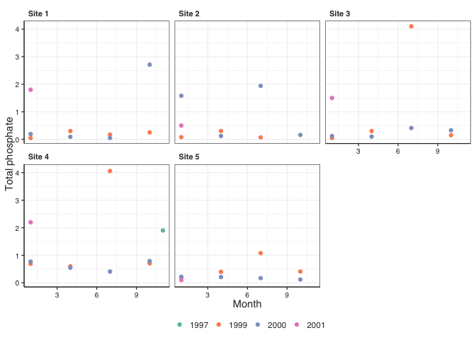
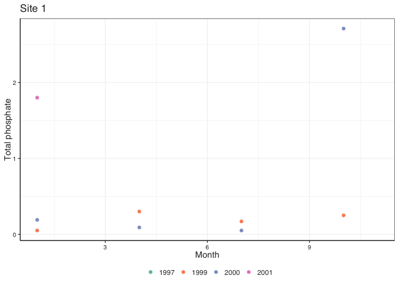

# Loading data

We are going to work again with the **ditch** dataset from the [Zur et al 2007](https://www.highstat.com/index.php/analysing-ecological-data) book.


```r
ditch_data_original <- read_csv(here("data", "ditch.csv"))

ditch_data_original
```

```
## # A tibble: 48 × 18
##    Site    Year Month Depth    pH Conductivity   BOD Ammoniacal_Nitrogen
##    <chr>  <dbl> <dbl> <dbl> <dbl>        <dbl> <dbl>               <dbl>
##  1 Site 1  1997    11 NA     7.62          511   7.1                 0.1
##  2 Site 1  1999     1  0.4   8.51          778   7.9                 0.2
##  3 Site 1  1999     4  0.25  7.71          517   3.6                 0.1
##  4 Site 1  1999     7  0.4   7.77         1892   3.4                 0.1
##  5 Site 1  1999    10  0.5   8.04         1600   4.2                 1.2
##  6 Site 1  2000     1  0.2   8.06          889   4.5                 0.8
##  7 Site 1  2000     4  0.75  7.72         1010   2                   0.1
##  8 Site 1  2000     7  0.1   7.94         1460   5.5                 0.3
##  9 Site 1  2000    10  0.75  7.21         1050   3.1                 0.6
## 10 Site 1  2001     1  0.1   7.7          1760  14                   3.4
## # … with 38 more rows, and 10 more variables: Total_Oxidised_Nitrogen <dbl>,
## #   Suspended_Solids <dbl>, Chloride <dbl>, Sulphate <dbl>,
## #   Total_Calcium <dbl>, Total_Zinc <dbl>, Total_Cadmium <dbl>,
## #   Total_Lead <dbl>, Total_Nickel <dbl>, Total_Phosphate <dbl>
```

# Data preparation


```r
ditch_data <- ditch_data_original %>% 
  clean_names() %>% 
  pivot_longer(cols = -c(site, year, month, depth),
               names_to = "parameter",
               values_to = "value")

ditch_data
```

```
## # A tibble: 672 × 6
##    site    year month depth parameter                value
##    <chr>  <dbl> <dbl> <dbl> <chr>                    <dbl>
##  1 Site 1  1997    11    NA p_h                       7.62
##  2 Site 1  1997    11    NA conductivity            511   
##  3 Site 1  1997    11    NA bod                       7.1 
##  4 Site 1  1997    11    NA ammoniacal_nitrogen       0.1 
##  5 Site 1  1997    11    NA total_oxidised_nitrogen   1.42
##  6 Site 1  1997    11    NA suspended_solids        441   
##  7 Site 1  1997    11    NA chloride                 43   
##  8 Site 1  1997    11    NA sulphate                 63   
##  9 Site 1  1997    11    NA total_calcium           104   
## 10 Site 1  1997    11    NA total_zinc                0.18
## # … with 662 more rows
```

# Preliminary look at the data


```r
ditch_data %>% 
  filter(parameter == "total_phosphate") %>% 
  ggplot() +
  facet_wrap(~ site) +
  geom_point(aes(x = month, y = value, colour = as.factor(year))) + 
  scale_color_brewer(palette = "Set2") +
  theme(legend.position = "bottom") +
  labs(x = "Month",
       y = "Total phosphate")
```

```
## Warning: Removed 3 rows containing missing values (geom_point).
```

<!-- -->

#  Let's use `pmap()`

The plot above is great, but what if we needed those pannels saved as individual plots? We could obviously make them individually by copy-pasting the code above and adding a `filter(site == XXXX)` step for each of the 5 sites... but what if instead of 5 sites i had 100? would you still want to do it that way?

Probably not, so we need a tool which will allow us to **automate** this process. Something that can perform a **task** (in this case creating the plot) in an iterative manner over a number of subsets of the data

## Create a nested tibble with the data subsets

To accomplish our task, the first thing we need is to prepare our data. What we want to do is to create **one plot for each site**. In the "hand made" option i provided above you would have needed to filter the data for each site and then make the plot. Same here, we need to create **subsets** of the data for each site.

Instead of doing it one by one by filtering, we are going to use `group_by()` and `nest()` to create a **nested tibble** containing those subsets:


```r
nested_data <- ditch_data %>% 
  filter(parameter == "total_phosphate") %>% 
  group_by(site) %>% 
  nest()

nested_data
```

```
## # A tibble: 5 × 2
## # Groups:   site [5]
##   site   data             
##   <chr>  <list>           
## 1 Site 1 <tibble [10 × 5]>
## 2 Site 2 <tibble [9 × 5]> 
## 3 Site 3 <tibble [10 × 5]>
## 4 Site 4 <tibble [10 × 5]>
## 5 Site 5 <tibble [9 × 5]>
```

## Apply the plot code to each subset

Now that we have our data subsets for each site, what we need is a tool which will allow us to apply the code that makes the plot to each subset. That tool is `pmap()`.

The idea will be to use `mutate()` to create a new column in the nested tibble wich will contain the plot.


```r
nested_data_and_plots <- nested_data %>% 
  mutate(plot = pmap(list(data, site),
                     ~ ggplot() +
                       geom_point(data = ..1, aes(x = month, y = value, colour = as.factor(year))) + 
                       scale_color_brewer(palette = "Set2") +
                       theme(legend.position = "bottom") +
                       labs(x = "Month",
                            y = "Total phosphate",
                            title = ..2)
  ))

nested_data_and_plots
```

```
## # A tibble: 5 × 3
## # Groups:   site [5]
##   site   data              plot  
##   <chr>  <list>            <list>
## 1 Site 1 <tibble [10 × 5]> <gg>  
## 2 Site 2 <tibble [9 × 5]>  <gg>  
## 3 Site 3 <tibble [10 × 5]> <gg>  
## 4 Site 4 <tibble [10 × 5]> <gg>  
## 5 Site 5 <tibble [9 × 5]>  <gg>
```


The coloum `plot` contains the plots generated for each site. WE can *dig* through it to se one of them


```r
nested_data_and_plots$plot[[1]]
```

```
## Warning: Removed 1 rows containing missing values (geom_point).
```

<!-- -->

## Prepping the plots to be saved individually

Now we have a bunch of plots contained in the nested tibble. To save them all individually we need to prepe the data a bit. 

First we need to create the names we want to give these files.


```r
data_for_plots <- nested_data_and_plots %>% 
  mutate(filename = str_c(site, "plot.pdf", sep = "_"))

data_for_plots
```

```
## # A tibble: 5 × 4
## # Groups:   site [5]
##   site   data              plot   filename       
##   <chr>  <list>            <list> <chr>          
## 1 Site 1 <tibble [10 × 5]> <gg>   Site 1_plot.pdf
## 2 Site 2 <tibble [9 × 5]>  <gg>   Site 2_plot.pdf
## 3 Site 3 <tibble [10 × 5]> <gg>   Site 3_plot.pdf
## 4 Site 4 <tibble [10 × 5]> <gg>   Site 4_plot.pdf
## 5 Site 5 <tibble [9 × 5]>  <gg>   Site 5_plot.pdf
```

Now we need to keep only what we need, i.e. the plots and their file names:


```r
data_for_plots %>% 
  select(plot, filename)
```

```
## Adding missing grouping variables: `site`
```

```
## # A tibble: 5 × 3
## # Groups:   site [5]
##   site   plot   filename       
##   <chr>  <list> <chr>          
## 1 Site 1 <gg>   Site 1_plot.pdf
## 2 Site 2 <gg>   Site 2_plot.pdf
## 3 Site 3 <gg>   Site 3_plot.pdf
## 4 Site 4 <gg>   Site 4_plot.pdf
## 5 Site 5 <gg>   Site 5_plot.pdf
```

oh, no! it doenst work. Site is a **grouping variable** in the dataset (from when we used `group_by()`). R is not gonna et you get rid of it without a fight!

We need to `ungroup()` first now that we dont need that column to be that important.


```r
data_for_plots_clean <- data_for_plots %>% 
  ungroup() %>% 
  select(plot, filename)

data_for_plots_clean
```

```
## # A tibble: 5 × 2
##   plot   filename       
##   <list> <chr>          
## 1 <gg>   Site 1_plot.pdf
## 2 <gg>   Site 2_plot.pdf
## 3 <gg>   Site 3_plot.pdf
## 4 <gg>   Site 4_plot.pdf
## 5 <gg>   Site 5_plot.pdf
```


## Save the plots

now that we have just the plot and its filename, we can apply `pwalk()`

NOTE: For this step to work, the `plot` and `filename` variable need to be called **exactly** that.


```r
pwalk(data_for_plots_clean,           # what we want to walk through
      ggsave,                    # what we want to do as we walk through the object   
      path =  here("figures"),   # where we want to save it
      width = 120, height = 120, units = "mm") # other things you need for ggsave
```

```
## Warning: Removed 1 rows containing missing values (geom_point).

## Warning: Removed 1 rows containing missing values (geom_point).

## Warning: Removed 1 rows containing missing values (geom_point).
```

